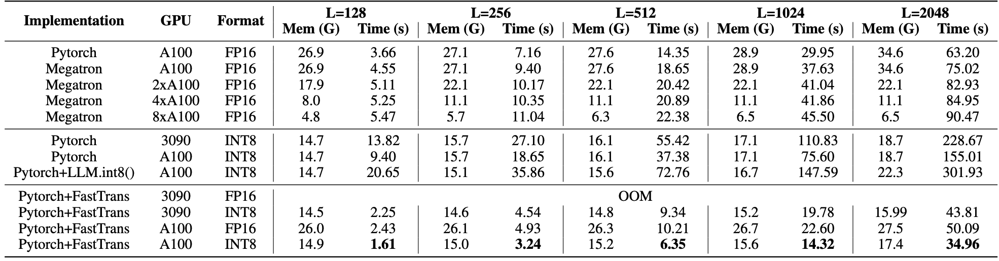

# CodeGeeX FasterTransformer

This repository provides the fastertrasformer implementation of [CodeGeeX](https://github.com/THUDM/CodeGeeX) model.

## Get Started
First, download and setup the following docker environment, replace ```<WORK_DIR>``` by the directory of this repo:
```
docker pull nvcr.io/nvidia/pytorch:21.11-py3
docker run -p 9114:5000 --cpus 12 --gpus '"device=0"' -it -v <WORK_DIR>:/workspace/codegeex-fastertransformer --ipc=host  --name=test nvcr.io/nvidia/pytorch:21.11-py3
```
Then, install following packages in the docker:
```
pip3 install transformers
pip3 install sentencepiece
cd codegeex-fastertransformer
sh make_all.sh  # Remember to specify the DSM version according to the GPU.
```
Finally, run ```api.py``` to start the server and run ```post.py``` to send request:
```
nohup python3 api.py > test.log 2>&1 &
python3 post.py
```
## Inference performance

The following figure compares the performances of pure Pytorch, Megatron and FasterTransformer under INT8 and FP16.
The fastest implementation is INT8 + FastTrans, and the average time of generating a token <15ms.

<div align=center></div>

## Liscense

Our code is licensed under the [Apache-2.0 license](LICENSE).
