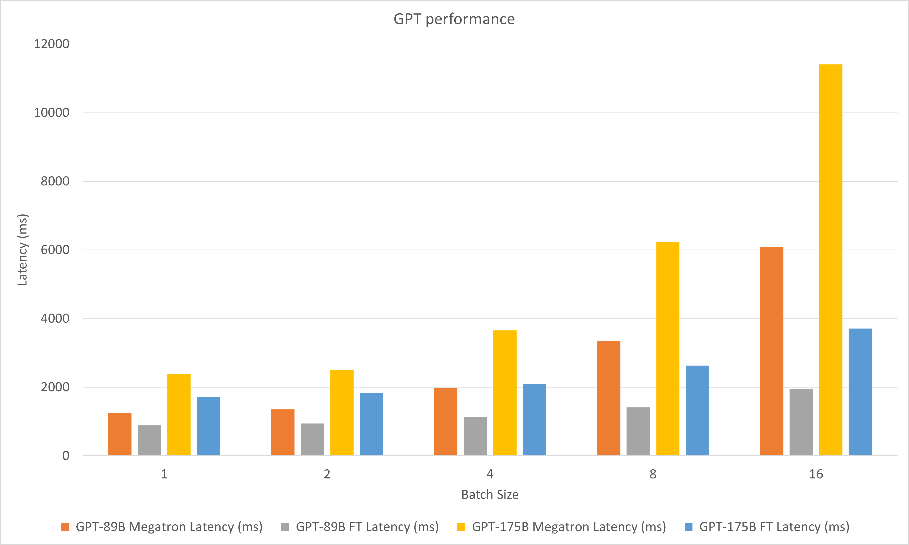

# CodeGeex FasterTransformer

This repository provides a script and recipe to run fastertransformer for codegeex.

## Table Of Contents

- [FasterTransformer](#fastertransformer)
  - [Table Of Contents](#table-of-contents)
  - [Model overview](#model-overview)
  - [Advanced](#advanced)
  - [Performance](#performance)
    - [CodeGeex performance](#codegeex-performance)
  - [Known issues](#known-issues)

## Model overview

FasterTransformer is built on top of CUDA, cuBLAS, cuBLASLt and C++. 

More details of specific models are put in `xxx_guide.md` of [`docs/`](docs), where `xxx` means the model name. Some common questions and the respective answers are put in [`docs/QAList.md`](docs/QAList.md). 

## Advanced

The following code lists the directory structure :

```bash
/src/fastertransformer: source code of FasterTransformer
    |--/models: Implementation of different models, like BERT, GPT.
    |--/layers: Implementation of layer modeuls, like attention layer, ffn layer.
    |--/kernels: CUDA kernels for different models/layers and operations, like addBiasResiual.
    |--/tensorrt_plugin: encapluate FasterTransformer into TensorRT plugin.
    |--/tf_op: custom Tensorflow OP implementation
    |--/th_op: custom PyTorch OP implementation
    |--/triton_backend: custom triton backend implementation
    |--/utils: Contains common cuda utils, like cublasMMWrapper, memory_utils
/examples: C++, tensorflow and pytorch interface examples
    |--/cpp: C++ interface examples
    |--/pytorch: PyTorch OP examples
    |--/tensorflow: TensorFlow OP examples
    |--tensorrt: TensorRT examples
/docs: Documents to explain the details of implementation of different models, and show the benchmark
/benchmark: Contains the scripts to run the benchmarks of different models
/tests: Unit tests
/templates: Documents to explain how to add a new model/example into FasterTransformer repo
```

Note that many folders contains many sub-folders to split different models. Quantization tools are move to `examples`, like `examples/tensorflow/bert/bert-quantization/` and `examples/pytorch/bert/bert-quantization-sparsity/`.

## Performance

Hardware settings:

* 8xA100-80GBs (with mclk 1593MHz, pclk 1410MHz) with AMD EPYC 7742 64-Core Processor
* T4 (with mclk 5000MHz, pclk 1590MHz) with Intel(R) Xeon(R) CPU E5-2670 0 @ 2.60GHz

In order to run the following benchmark, we need to install the unix computing tool "bc" by

```bash
apt-get install bc
```


### CodeGeex performance

The following figure compares the performances of Megatron and FasterTransformer under FP16 on A100.

In the experiments of decoding, we updated the following parameters:

* head_num = 40
* size_per_head = 128
* num_layers = 40
* data_type = FP16
* vocab_size = 52224
* top_p = 0.9
* tensor parallel size = 1
* input sequence length = 512
* ouptut sequence length = 2048

<div align=center></div>


## Known issues

- Undefined symbol errors when import the extension
  - Please `import torch` first. If this has been done, it is due to the incompatible C++ ABI. You may need to check the PyTorch used during compilation and execution are the same, or you need to check how your PyTorch is compiled, or the version of your GCC, etc.
- Results of TensorFlow and OP would be different in decoding. This problem is caused by the accumulated log probability, and we do not avoid this problem.
- If encounter some problem in the custom environment, try to use the gcc/g++ 4.8 to build the project of TensorFlow op, especially for TensorFlow 1.14.
